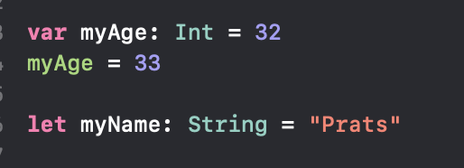
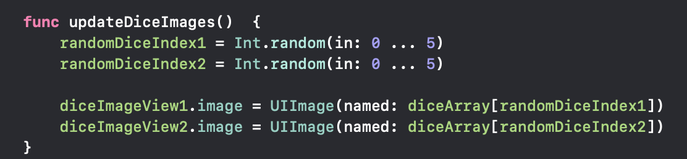

# Programming constructs for Python, Javascript, Kotlin & Swift


## Declaring and assigning variables

### Swift
`let` for constant and `var` for mutable variables. Good practice to assign the data type to the variable declaration


### Python
Convention - lowercase and underscore for space. Use uppercamelcase for classes
```python
my_num = 5
my_str = 'Hello World'
```
### Javascript
Convention - lowercamelcase for variables
```javascript
var myNum = 10;
var myStr = 'Hello World';
```
If it is ES6 then 
```javascript
let myVar = 30
const myStr = 'hello'
```
#### Difference between `let`, `const` and `var`

```javascript
var myStr = 'hello';
var myStr = 'World'; // Doesn't throw an error. Can be problematic in large files

let myStr = 'hello'
let myStr = 'goodbye' // Throws an error. We cant redeclare with the same variable name
myStr = 'hi'  // Reassignment is possible

const myNum = 10
myNum = 30  // Throws an error. Can reassign to variables declared with const keyword
```

## Printing and string formatting

### Python
```python
print('Hello World')

my_str = 'Prats'
print(f'Hello {my_str}')  // Hello Prats
```

### Javascript
```javascript
console.log('Hello World');

let str = 'Prat'
console.log('Hello ' + str);
```

## Conditional logic: Booleans and comparisons

### python
### javascript

## Loops
## Functions

### Swift

## Variable scopes
## Array
## Object
## Arithmatic
## Getting user input
## list tuples, dictionaries and set

